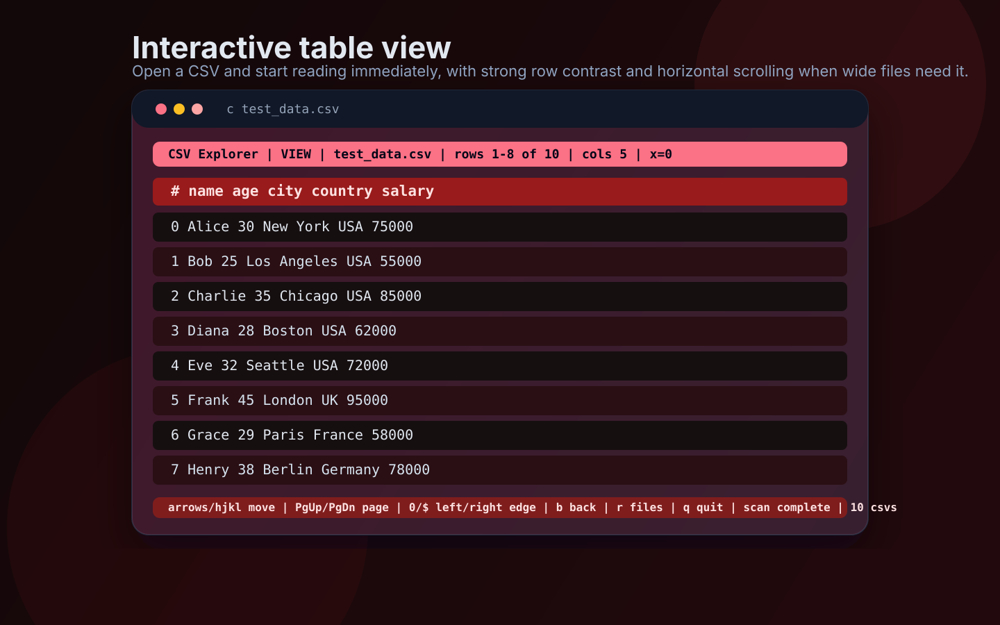
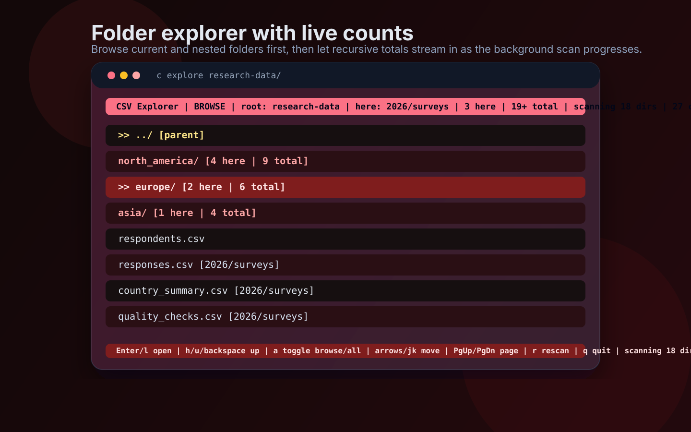

# csvex

<p align="center">
  
  
  
  
</p>

<p align="center">
  <strong>Explore, compare, inspect, and query tabular data from the terminal.</strong>
</p>

<p align="center">
  Open a file into a layered red interactive table, browse folders with live counts, compare
  related CSVs, inspect columns, export filtered views, run schema drift checks, and use SQL
  without leaving the shell.
</p>

<p align="center">
  
  
</p>

## What It Can Do

- open `.csv`, `.tsv`, `.txt`, compressed text files like `.csv.gz`, and `.parquet`
- launch a bundled guided demo with `csvex demo`
- launch a colorful TUI with `csvex data.csv` or browse folders with `csvex explore`
- fuzzy-find files and folders inside the explorer with `/`
- search rows, filter columns, sort data, pin columns, hide columns, and export visible views
- inspect a selected column with mini charts and run lightweight data quality checks
- keep favorites and recent files in the explorer
- compare two files and show added, removed, and changed rows
- summarize a folder of files and detect schema drift across it
- run SQL against a single file with an in-memory table named `data`
- read from `stdin` with `csvex - ...`

## Quick Start

### Editable install with global commands

```bash
./install-dev-global.sh
```

This creates `.venv`, installs the project in editable mode, and links both `csvex` and `c`
into `/usr/local/bin`.

### User install

```bash
python3 -m pip install --user .
```

## Common Flows

### Show the banner and quick-start guide

```bash
csvex
c
```

### Launch the built-in demo

```bash
csvex demo
csvex demo --browse
c demo
```

`csvex demo` opens a bundled showcase dataset and starts with a guided overlay. From there you can
press `b` to browse the rest of the demo pack, including a compare-friendly sales pair, a survey
dataset, and a TSV inventory file.

### Open a file in the interactive table view

```bash
csvex data.csv
c data.csv
```

Large text files automatically open in preview mode inside the TUI so startup stays responsive.

### Browse a folder

```bash
csvex explore
csvex explore data/
c explore .
```

### Compare two files

```bash
csvex compare before.csv after.csv --key id
```

### Run SQL against one file

```bash
csvex sql data.csv "select country, count(*) as total from data group by country order by total desc"
```

### Summarize a folder and check schema drift

```bash
csvex summary data/
csvex drift data/
```

### Use the shell-friendly file commands

```bash
csvex data.csv head -n 20
csvex data.csv filter age '>' 30
csvex data.csv select name email salary
csvex data.csv inspect country
csvex data.csv quality
csvex data.csv export output.csv
```

### Read from stdin

```bash
printf 'name\tage\nAna\t30\nBen\t41\n' | csvex - head -n 2
```

## Commands

| Command | Description |
| --- | --- |
| `head [-n N]` | Display the first `N` rows |
| `filter <col> <op> <val>` | Filter rows by value |
| `select <cols...>` | Show only selected columns |
| `stats` | Show numeric summary statistics |
| `unique <col>` | List unique values in a column |
| `inspect <col>` | Inspect one column in depth |
| `quality` | Run lightweight data quality checks |
| `export <path>` | Export the file to another path |
| `explore [path]` | Open the interactive explorer |
| `demo [entry] [--browse]` | Launch the bundled csvex showcase workspace |
| `summary [path]` | Summarize a folder or one file |
| `drift [path]` | Show schema drift across a folder |
| `compare <left> <right> [--key col]` | Compare two files |
| `sql <file> "<query>"` | Run an in-memory SQL query against one file |

## TUI Controls

### Explorer

- `Enter` or `l`: open the selected folder or file
- `h`, `u`, or `Backspace`: go up one folder
- `a`: toggle folder browser and recursive all-files view
- `F`: toggle favorites view
- `R`: toggle recents view
- `*`: add or remove the selected item from favorites
- `/`: fuzzy-find files and folders in the current explorer view
- `C`: clear the explorer search filter
- `m`: show a folder summary overlay
- `D`: show schema drift for the current folder or root
- `Up/Down` or `j/k`: move selection
- `PgUp/PgDn`: page through entries
- `g` / `G`: jump to top or bottom
- `r`: rescan
- `?`: help overlay
- `q`: quit

### Viewer

- `Up/Down` or `j/k`: move the selected row
- `Left/Right` or `h/l`: scroll horizontally
- `PgUp/PgDn`: page through rows
- `g` / `G`: jump to top or bottom
- `0` / `$`: jump to the left or right edge
- `[` / `]`: move the active column
- `/`, `n`, `N`: search rows and cycle through matches
- `f`: filter the active column with a contains match
- `C`: clear search and filter state
- `s` / `S`: sort ascending or descending by the active column
- `x` / `X`: hide the active column or restore all columns
- `p`: pin or unpin the active column
- `Enter`: open the selected row detail view
- `i`: inspect the active column
- `d`: show file-wide data quality checks
- `e`: export the current visible view
- `w`: watch the file for changes and auto-reload it
- `R`: reload the active file immediately
- `b`: go back to the file list
- `r`: go back to files and rescan
- `?`: help overlay
- `q`: quit

## Supported Formats

- `.csv`
- `.tsv`
- `.txt`
- `.csv.gz`, `.tsv.gz`, and other pandas-supported compressed text variants
- `.parquet`
- `stdin` via `-`

## Contributing

`csvex` is still intentionally compact enough to hack on quickly. Most of the behavior lives in
`csvex.py`, so it is easy to trace loader logic, CLI dispatch, explorer state, and TUI rendering.

Good contribution areas:

- stronger large-file support beyond preview mode
- richer SQL features and multi-file joins
- better schema drift reports and validations
- smarter data quality checks
- deeper tests around curses behavior and parser edge cases

Basic development loop:

```bash
./install-dev-global.sh
python3 -m py_compile csvex.py
c
c test_data.csv
c explore .
```

## License

MIT
